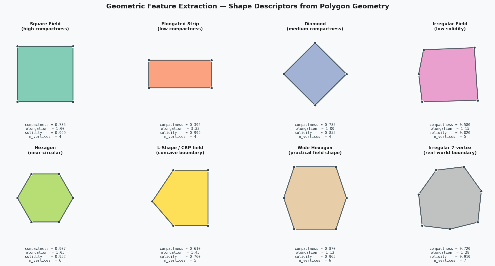
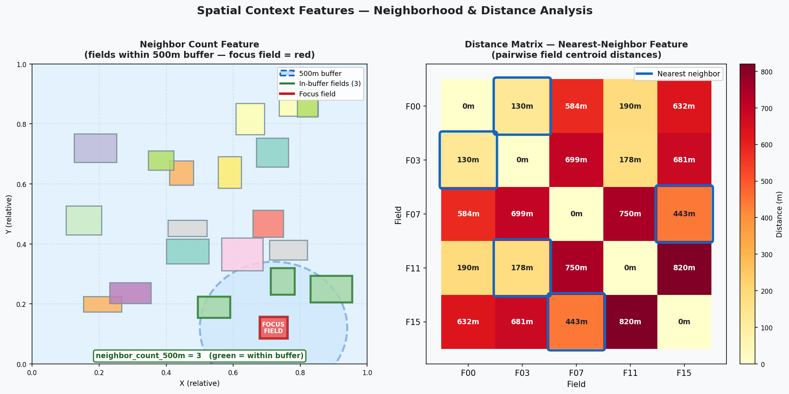
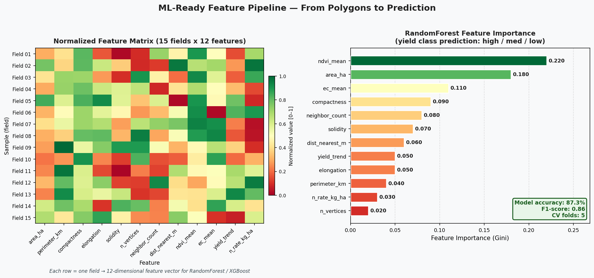

# Feature Extraction from Geospatial Shapefiles
### Author: Emmanuel Oyekanlu — Principal AI/Data Solutions Engineer

---

## Visual Gallery

The images below are generated directly from this repository's code using only `matplotlib` and `numpy`.

### Geometric Feature Extraction — Shape Descriptors
Eight field polygon shapes annotated with computed descriptors: `compactness`, `elongation`, `solidity`, and `n_vertices` — showing how the same formula produces different values across square, elongated, irregular, and concave field geometries.



### Spatial Context Features — Buffer Neighbor Count & Distance Matrix
Left: 500m buffer around a focus field with in-buffer neighbors highlighted (green) — the `neighbor_count_500m` feature. Right: pairwise distance matrix heatmap for 5 selected fields with nearest-neighbor boxes highlighted.



### ML-Ready Feature Pipeline — Feature Matrix & Importance
Left: normalized 15×12 feature matrix (each row = one field, RdYlGn colormap). Right: RandomForest feature importance ranking showing `ndvi_mean` and `area_ha` as top predictors of yield class.



---

## Overview

This repository demonstrates expert-level feature extraction from geospatial shapefiles — a core skill in precision agriculture data engineering, directly aligned with Bayer's requirement for "processing and extracting features from geospatial shapefiles."

Feature extraction transforms raw polygon geometry and tabular attributes into a rich numerical feature matrix suitable for machine learning models. For agricultural field data, this means going from "a polygon with crop_type=corn and area=50ha" to a 40-dimensional feature vector capturing shape, context, temporal dynamics, and spatial relationships.

---

## Why Feature Extraction Matters for Geospatial ML

Standard ML models work with fixed-size numerical vectors. Geospatial data presents unique challenges:

- **Variable-geometry features**: Polygons have different numbers of vertices — you can't directly feed them to a classifier
- **Spatial autocorrelation**: Neighboring fields are not independent samples — this violates i.i.d. assumptions
- **Multi-scale context**: A field's characteristics depend on what's around it at 100m, 1km, and 10km scales
- **Temporal patterns**: Yield data across 5 years is more predictive than any single year

This repository systematically addresses each challenge.

---

## Feature Categories Extracted

### 1. Geometric Features (Script 01)
Shape descriptors extracted from polygon geometry:

| Feature | Formula | What It Captures |
|---------|---------|-----------------|
| `area_ha` | Area in hectares | Field size |
| `perimeter_km` | Perimeter in km | Boundary length |
| `compactness` | 4π·area / perimeter² | Shape regularity (circle=1) |
| `elongation` | max_bb_dim / min_bb_dim | How stretched the field is |
| `solidity` | area / convex_hull_area | Concavity / irregular shape |
| `convexity` | convex_hull_perimeter / perimeter | Boundary smoothness |
| `n_vertices` | Count of polygon vertices | Shape complexity |

### 2. Attribute Features (Script 02)
Engineered from tabular attributes using sklearn pipelines:
- Categorical encoding of crop_type
- Area size classes (binning)
- Yield per area ratio features
- Normalized numeric features
- One-hot encoded soil_type

### 3. Spatial Context Features (Script 03)
Neighborhood-based features requiring spatial index:
- Distance to nearest neighboring field
- Count of fields within 500m buffer
- Mean area of nearby fields
- Dominant neighbor crop type
- Edge density (compactness relative to neighbors)

### 4. Topological Features (Script 04)
Adjacency structure between fields:
- Shared boundary length with each neighbor
- Adjacency count (degree in spatial graph)
- Isolation flag (no shared boundaries)
- Connectivity statistics

### 5. Time Series Features (Script 05)
From 5-year yield data (2021-2025):
- Linear trend slope
- Mean, standard deviation, coefficient of variation
- Year-over-year changes
- Best/worst year identification
- Anomaly detection (>2σ from mean)

### 6. ML-Ready Pipeline (Script 06)
End-to-end pipeline combining all features → RandomForest classifier

---

## Repository Structure

```
09_feature_extraction_shapefiles/
├── README.md
├── requirements.txt
├── .gitignore
├── 01_geometry_feature_extraction.py
├── 02_attribute_feature_engineering.py
├── 03_spatial_context_features.py
├── 04_topology_feature_extraction.py
├── 05_time_series_feature_extraction.py
├── 06_ml_ready_feature_pipeline.py
└── data/
    └── agricultural_fields.geojson
```

---

## Installation

```bash
pip install -r requirements.txt
```

## Usage

```bash
python 01_geometry_feature_extraction.py   # Outputs: geometry_features.csv
python 02_attribute_feature_engineering.py # Outputs: attribute_features.csv
python 03_spatial_context_features.py      # Outputs: spatial_context_features.csv
python 04_topology_feature_extraction.py   # Outputs: topology_features.csv
python 05_time_series_feature_extraction.py # Outputs: time_series_features.csv
python 06_ml_ready_feature_pipeline.py     # Full pipeline + RandomForest
```

---

## Detailed Feature Descriptions

### Geometric Shape Descriptors

**Compactness (Polsby-Popper score)**
```
compactness = (4π × area) / perimeter²
```
Range: (0, 1]. A perfect circle = 1.0. A square ≈ 0.785. Real agricultural fields
typically range from 0.3 to 0.9. Very low compactness (<0.3) usually means a jagged,
irregular boundary or a highly elongated strip field.

**Solidity**
```
solidity = polygon_area / convex_hull_area
```
Measures how "convex" the field is. A perfectly rectangular field has solidity ≈ 1.0.
A field with drainage channels carved into it might have solidity of 0.7-0.8.

**Edge Density**
```
edge_density = perimeter / sqrt(area)
```
Normalizes boundary length by field size. Fields with the same compactness but different
sizes have different edge densities. High edge density relative to neighbors indicates
a fragmented ownership pattern.

### Time Series Feature Notes

The 5-year yield time series (2021-2025) is short for ARIMA but sufficient for
extracting trend and variability features. The **coefficient of variation (CV)**
is particularly useful:

- CV < 0.1 (10%) — highly stable, well-managed field
- CV 0.1-0.2 — normal agricultural variability
- CV > 0.3 — high variability, possibly drought-prone, poor soil, or inconsistent management

### Spatial Context Features at Scale

The 500m neighborhood radius is configurable. In production:
- Use 100m for precision agriculture (single-field decisions)
- Use 1km for watershed-level analysis
- Use 10km for regional market/logistics analysis

The STRtree spatial index makes it practical to compute neighborhood features
for millions of fields without O(n²) performance degradation.

---

## Production Deployment Pattern

In a production Bayer-style pipeline, feature extraction runs as a multi-stage
Airflow DAG:

```
load_shapefile_task
       │
       ├─ geometry_features_task  (parallelizable per field)
       ├─ attribute_features_task (parallelizable per field)
       └─ time_series_features_task (parallelizable per field)
              │
              ▼
       merge_features_task
              │
              ▼
       ml_scoring_task  (apply pre-trained model)
              │
              ▼
       write_scores_to_iceberg_task
```

The feature extraction tasks (geometry, attribute, time series) are fully
parallelizable using Dask or Spark — each field's features are independent.

---

## Key Libraries

| Library | Role |
|---------|------|
| `geopandas` | GeoDataFrame operations, spatial joins, I/O |
| `shapely` | Geometry computation (area, perimeter, convex hull, STRtree) |
| `fiona` | Shapefile I/O with schema inspection |
| `scikit-learn` | ColumnTransformer, RandomForest, cross-validation |
| `scipy.stats` | Linear regression for yield trend slopes |
| `numpy` | Numerical array operations |
| `pandas` | Tabular feature matrix operations |
| `matplotlib` | Feature importance visualization |

---

*Emmanuel Oyekanlu — Principal Data Engineer | Geospatial Feature Engineering for Precision Agriculture*

